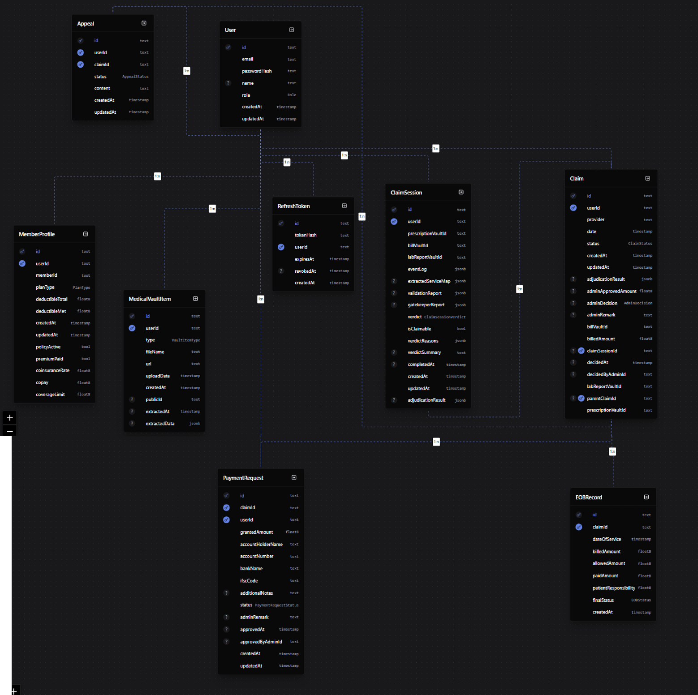
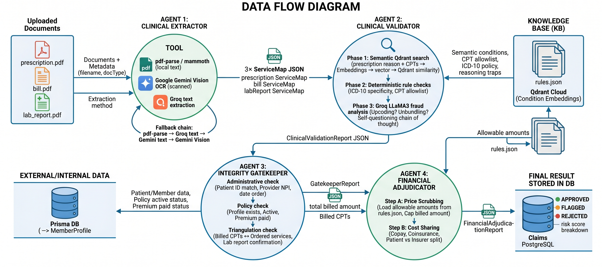
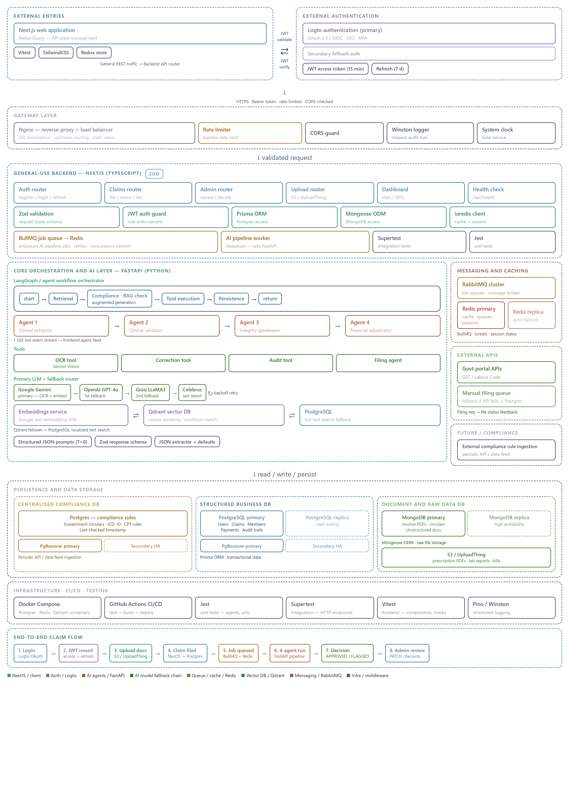

# System Diagrams

Visual representations of ClaimGuard.ai's architecture and data flow.

---

## MVP Architecture Diagram

```
┌─────────────────────────────────────────────────────────────┐
│                    Browser / Client                         │
│           React 18 + Vite + TailwindCSS                     │
└────────────────────────┬────────────────────────────────────┘
                         │ REST API + JWT
                         ▼
┌─────────────────────────────────────────────────────────────┐
│                  Node.js + Express Backend                  │
│                                                             │
│  ┌──────────┐  ┌────────────┐  ┌──────────┐  ┌──────────┐ │
│  │   Auth   │  │   Claims   │  │   Admin  │  │  Health  │ │
│  │  Routes  │  │   Routes   │  │  Routes  │  │  Check   │ │
│  └──────────┘  └─────┬──────┘  └──────────┘  └──────────┘ │
│                      │                                      │
│          ┌───────────▼──────────────────────┐              │
│          │       4-Agent AI Pipeline         │              │
│          │                                  │              │
│          │  [1] Clinical Extractor           │              │
│          │      ↓ ServiceMap × 3             │              │
│          │  [2] Clinical Validator           │              │
│          │      ↓ ValidationReport           │              │
│          │  [3] Integrity Gatekeeper         │              │
│          │      ↓ GatekeeperReport           │              │
│          │  [4] Financial Adjudicator        │              │
│          │      ↓ AdjudicationReport         │              │
│          └──────────────────────────────────┘              │
└──────┬──────────────────────────┬───────────────┬──────────┘
       │                          │               │
       ▼                          ▼               ▼
┌────────────┐         ┌──────────────┐  ┌──────────────────┐
│ PostgreSQL │         │    Qdrant    │  │  External APIs   │
│ (Prisma)   │         │ Vector Store │  │                  │
│            │         │              │  │  Google Gemini   │
│ - Users    │         │ - Condition  │  │  (OCR + Embed)   │
│ - Claims   │         │   Embeddings │  │                  │
│ - Members  │         │ - CPT Rules  │  │  Groq LLaMA3     │
│ - Payments │         │ - Fraud Cues │  │  (Fraud LLM)     │
└────────────┘         └──────────────┘  │                  │
                                         │  UploadThing     │
                                         │  (File Storage)  │
                                         └──────────────────┘

```

---
## Data Model Diagram



---

## Data Flow Diagram


## AI Pipeline Flow Diagram

```
Uploaded Documents
(prescription.pdf + bill.pdf + lab_report.pdf)
              │
              ▼
┌─────────────────────────────────────────┐
│  AGENT 1: Clinical Extractor            │
│                                         │
│  pdf-parse / mammoth (local text)       │
│     → Groq text extraction              │
│  OR Google Gemini Vision (scanned)      │
│                                         │
│  Output: 3× ServiceMap JSON             │
└──────────────────┬──────────────────────┘
                   │
                   ▼
┌─────────────────────────────────────────┐
│  AGENT 2: Clinical Validator            │
│                                         │
│  Phase 1: Semantic Qdrant search        │
│    prescription reason + CPTs           │
│    → Google Embeddings → vector         │
│    → Qdrant cosine similarity           │
│    → Matched condition + rules          │
│                                         │
│  Phase 2: Deterministic rule checks     │
│    ICD-10 specificity (leaf node)       │
│    CPT allowlist enforcement            │
│                                         │
│  Phase 3: Groq LLaMA3 fraud analysis   │
│    Upcoding? Unbundling?                │
│    Self-questioning chain of thought    │
│                                         │
│  Output: ClinicalValidationReport       │
└──────────────────┬──────────────────────┘
                   │
                   ▼
┌─────────────────────────────────────────┐
│  AGENT 3: Integrity Gatekeeper          │
│                                         │
│  Administrative check                   │
│    Patient ID match across docs         │
│    Provider NPI present                 │
│    Chronological date order             │
│                                         │
│  Policy check (Prisma DB)              │
│    Member profile exists                │
│    Policy active + premium paid         │
│                                         │
│  Triangulation check                    │
│    Billed CPTs ⟷ Ordered services     │
│    Lab report confirms service          │
│                                         │
│  Output: GatekeeperReport               │
└──────────────────┬──────────────────────┘
                   │
                   ▼
┌─────────────────────────────────────────┐
│  AGENT 4: Financial Adjudicator         │
│                                         │
│  Step A: Price Scrubbing                │
│    Load allowable amounts (rules.json)  │
│    Cap billed amount at allowable       │
│                                         │
│  Step B: Cost Sharing                   │
│    Copay (from policy / condition)      │
│    Coinsurance (rate × approved)        │
│    Patient vs Insurer split             │
│                                         │
│  Output: FinancialAdjudicationReport    │
└──────────────────┬──────────────────────┘
                   │
                   ▼
         ┌─────────────────┐
         │  Final Result   │
         │  Stored in DB   │
         │                 │
         │  APPROVED ✅    │
         │  FLAGGED ⚠️    │
         │  REJECTED ❌    │
         └─────────────────┘
```

---


## Product Architecture

